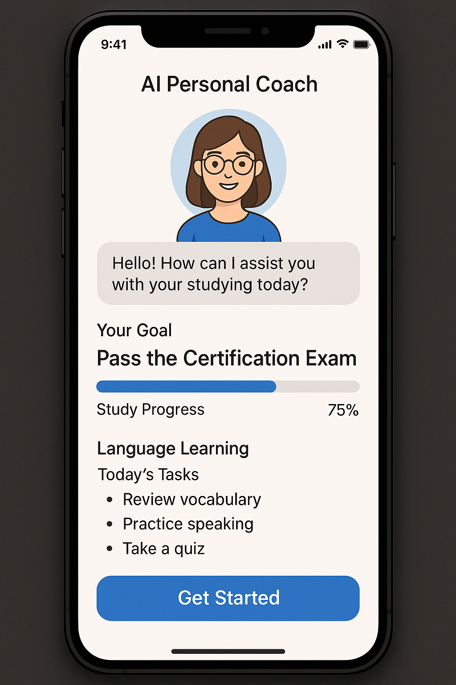

# 📚 FocusBot – AIがあなたの学習を最適化するパーソナル学習プランナー



> ✨ **資格取得や語学学習に取り組む人のための、AIパーソナルコーチ**  
> OpenAI × Next.js × Firebase で構築されたSaaS風アプリです。

---

## 🚀 概要

**FocusBot**は、ユーザーが目標とする「資格取得」や「学習課題」に応じて、  
**AIが学習プランを自動生成し、日々のタスクを最適化**してくれるアプリです。

タスク管理、実績記録、振り返り提案などを一元化し、  
**習慣化 × 最短ルート学習**を支援します。

---

## 🖥️ 画面構成

| 画面 | 機能 |
|------|------|
| ホーム（ダッシュボード） | 今日のタスク、進捗バー、モチベーションスコア表示 |
| プラン作成画面 | 目標入力 → ChatGPT APIで学習プラン生成 |
| タスク管理画面 | タスクリスト・達成ボタン・自動記録 |
| 履歴・レポート画面 | 過去の学習実績・達成率グラフ・AIによる振り返り提案 |
| 設定画面 | プロフィール、目標の編集、通知設定など |

---

## 🧠 AI活用機能

- 🎯 **目標ベース学習プラン生成**  
　例：「TOEIC 700点を3ヶ月で取得」→ 週次・日次プランをAIが自動生成

- 📈 **振り返りと改善提案**  
　達成率や履歴をもとに、次週の改善点をAIが提案

- ⏳ **スキマ時間学習の即時提案**  
　「今から20分ある」と入力すると、最適な学習アクションを提示

---

## 🛠️ 使用技術スタック

| 分類 | 技術 |
|------|------|
| フロント | Next.js (App Router) / TypeScript / Tailwind CSS |
| バックエンド | Next.js API Routes（Node.js） / OpenAI API |
| 認証 | Firebase Authentication（Googleログイン） |
| データベース | Firebase Firestore |
| デプロイ | Vercel |
| 状態管理 | Zustand |
| その他 | Chart.js / date-fns |

---

## 📁 ディレクトリ構成（抜粋）
/app
/dashboard # ホーム画面
/planner # プラン作成画面
/tasks # タスク管理
/history # 履歴・レポート
/settings # ユーザー設定
/api
/gpt # ChatGPT API連携
/task # タスク管理API
/components # UIコンポーネント
/lib # API・ユーティリティ関数

---

## 🔐 認証とセキュリティ

- Firebase Authentication による Google ログイン対応
- Firestore Security Rules によるユーザー毎のデータ保護
- OpenAI APIキーは `.env` 環境変数にて安全に管理

---

## 💬 今後の追加予定機能

- 📅 Googleカレンダー連携（学習スケジュールと同期）
- 🔔 プッシュ通知（習慣化リマインダー）
- 🎓 資格別テンプレート搭載（英語/IT/国家試験など）
- 📊 学習タイプ診断（AIによるパーソナライズ強化）

---

## 🎯 開発の背景と目的

エンジニアとして働きながら「時間がない中で効率的に資格を取りたい」「やる気が続かない」と感じていたことから、  
**“継続を仕組み化”するAI学習コーチを自作したい**と考え、UI/UX・技術・実用性を意識して開発しました。

---


## ▶️ デモ

🟢 デモURL（Vercelにデプロイ済）：  
**[https://focusbot.vercel.app](https://focusbot.vercel.app)**

🧪 テストアカウント（ログイン不要モードがない場合）：  
- Email: `demo@focusbot.dev`  
- Password: `focus123`

---

## 🔧 ローカル起動手順

```bash
# 1. リポジトリをクローン
git clone https://github.com/kana-coco/FocusBot-AI.git　
cd focusbot

# 2. 環境変数設定
cp .env.example .env.local
# 以下を入力:
# OPENAI_API_KEY=your_openai_key
# FIREBASE_API_KEY=your_firebase_key
# ...他必要なFirebase設定

# 3. パッケージインストール
npm install

# 4. 開発サーバー起動
npm run dev

```
---
### 開発スタックの技術構成
| 要素    | 技術                                               |
| ----- | ------------------------------------------------ |
| フロント  | Next.js (App Router構成), TypeScript, Tailwind CSS |
| UI管理  | Zustand（状態管理）, Chart.js（グラフ）                     |
| 認証    | Firebase Authentication                          |
| データ保存 | Firebase Firestore                               |
| AI連携  | OpenAI API（gpt-3.5/4）                            |
| デプロイ  | Vercel                                           |
| その他   | ESLint, Prettier, dotenv                         |


---

### ✅ このあとやることチェックリスト（README完成後）

- [ ] `screenshot.png`（トップページUIなど）を `/public/` に設置
- [ ] `.env.example` をルートに追加
- [ ] 実際の `your-username` や `your-portfolio-link` を正しいURLに差し替え
- [ ] ZennやQiitaに開発記録や設計意図の記事を投稿 → SEO＆信頼性アップ

ご希望があれば `.env.example` の内容や、OpenAI APIのラッパーコード、Firestoreのスキーマ案もお出しできます！
